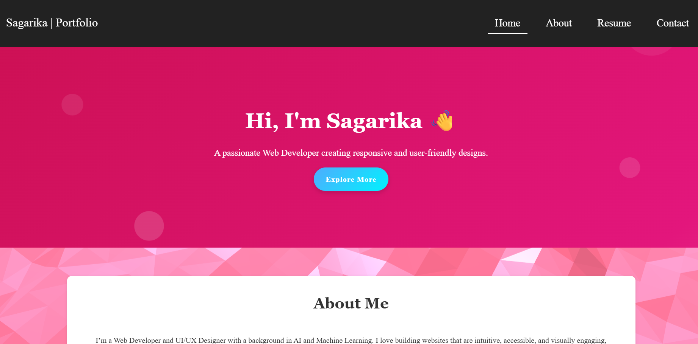
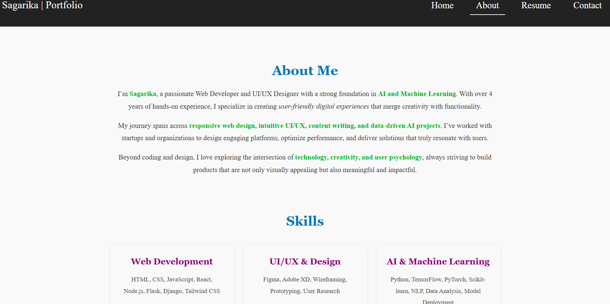
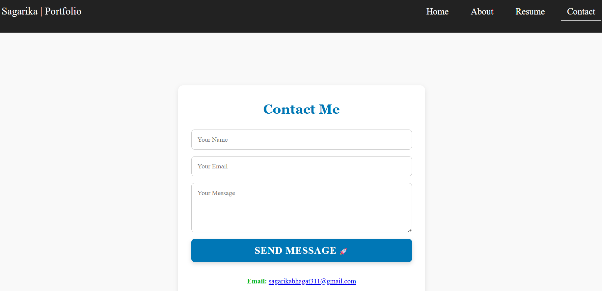

# Portfolio Website Design

A responsive, modern, and interactive personal portfolio website built using **HTML, CSS, and JavaScript**. The site showcases my skills, projects, achievements, and provides a platform for visitors to get in touch.  

Live demo: [https://sagarikabhagat.netlify.app](https://sagarikabhagat.netlify.app)

---

## Features

- **Responsive Design:** Works seamlessly on desktop, tablet, and mobile devices.  
- **Interactive UI:** Smooth animations, floating bubbles, and waves background powered by **Vanta.js** and custom CSS.  
- **Navigation:** Fixed navbar with smooth scrolling and active link highlights.  
- **Projects Section:** Highlights my featured projects with links to GitHub repositories.  
- **Achievements Section:** Showcases key certifications and awards.  
- **Contact Section:** Quick access to contact form for potential collaborations.  

---

## Sections

1. **Hero:** Introduction with a friendly greeting and a call-to-action button.  
2. **About Me:** A brief summary of my skills, experience, and interests.  
3. **Services:** Overview of my core skills: Web Development, UI/UX Design, and Content Writing.  
4. **Projects:** Featured projects with descriptions and GitHub links.  
5. **Achievements:** Recognition and certifications.  
6. **Contact CTA:** Encourages visitors to reach out for collaborations.  
7. **Footer:** Simple footer with copyright notice.

---

## Technologies Used

- **HTML5 & CSS3** – Structure and styling  
- **JavaScript** – Interactivity and dynamic effects  
- **Vanta.js** – Animated waves background  
- **Three.js** – 3D effects support for Vanta.js  
- **PDF Integration** – Resume available for download  

---

## Folder Structure

```

portfolio/
├── index.html           # Home page
├── about.html           # About page
├── contact.html         # Contact page
├── style.css            # Main stylesheet
├── script.js            # Custom JS for interactivity
├── files/
│   └── Sagarika\_CV.pdf  # Resume
├── screenshots/         # Screenshots for README (optional)
└── README.md

````

---

## How to Run Locally

1. Clone the repository:
   ```bash
   git clone https://github.com/Sagarika311/Portfolio-Website.git
   ```
2. Navigate to the project folder:
   ```bash
   cd Portfolio-Website
   ```
3. Open `index.html` in your browser.
4. Ensure you have an internet connection for external scripts like **Three.js** and **Vanta.js**.

--- 

## Screenshots





---

## Projects Featured

* **[Chatbot for Customer Service](https://github.com/Sagarika311/Chatbot-for-Customer-Service)** – AI-powered chatbot using Flask and OpenAI API.
* **[Sentiment Analysis of Reviews](https://github.com/Sagarika311/Sentiment-Analysis-of-Product-Reviews)** – ML + NLP project with Flask interface.
* **[Credit Card Fraud Detection](https://github.com/Sagarika311/Credit-Card-Fraud-Detection-using-ML)** – Machine learning model for fraud detection.

For more projects, visit my [GitHub](https://github.com/Sagarika311).

---

## Achievements

* **Smart India Hackathon 2023 Finalist**
* **Google Cloud Certified: Cloud Digital Leader**
* Certified in **Machine Learning, Generative AI, Data Visualization** (IBM, UW, Rice University)

---

## Contact

* 📧 Email: [sagarikabhagat311@gmail.com](mailto:sagarikabhagat311@gmail.com)
* 🔗 LinkedIn: [Sagarika Bhagat](https://linkedin.com/in/sagarika-bhagat)

---

## License

This project is **open source** and available under the MIT License.
